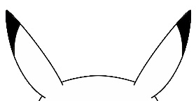
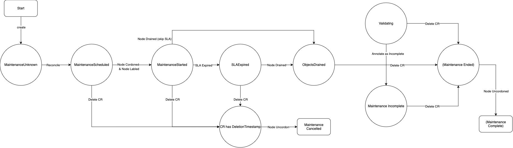

# PIKA and NotifyMaintenance
Controller and API for coordinating Maintenance operations in Kubernetes.



## Our Approach
How an End User drains workloads and conducts Maintenance is unique, however
every Maintenance follows the same steps:
1. Schedule a Drain
2. Start a Drain
3. Complete a Drain
4. Start a Maintenance
5. Complete a Maintenance or Fail a Maintenance
6. Start a Validation Job
7. Pass Validation or Fail Validation
8. Return to Production

We created the NotifyMaintenance API to track these common states.

## NotifyMaintenance API
The NotifyMaintenance API is a Kubernetes CRD that proivdes a description
of a Maintenance and the state of that Maintenance.  Using well-known states,
controllers & operators can coordinate with on another to run complex drain
and upgrade operations.


| Maintenance Status     | Event                                                      | Description                                                                                    |
|------------------------|------------------------------------------------------------|------------------------------------------------------------------------------------------------|
| MaintenanceUnknown     | NotifyMaintenance Creation                                 | A NotifyMaintenance has been created, but it's yet to be reconciled                            |
| MaintenanceScheduled   | Maintenance was scheduled, ready to start                  | A NotifyMaintenance has been reconciled by PIKA                                                |
| MaintenanceStarted     | Node was cordoned and labeled                              | Notify watchers that a Node is activly draining                                                |
| SLAExpired             | Workload drain SLA has been met                            | Notify watchers that any objects remaining may be forcefully removed at any time               |
| ObjectsDrained         | Node is drained                                            | Notify wachters that a Node is drained and maintenance can start on the Node                   |  
| Validating             | Test that a Node is ready for Production                   | Notify wachters that a Node is being validated as ready for production                         |
| MaintenanceIncomplete  | Maintenance wasn't completed                               | A maintenance wasn't completed for any reason. The Node is not ready for production            |
| *_MaintenanceEnded_    | A request was made to delete a NotifyMaintenance           | A NotifyMaintenance object has a deletionTimestamp                                             |
| *_MaintenanceComplete_ | A Node was uncordoned and the NotifyMaintenance removed    | A NotifyMaintenance object was removed and a Node uncordoned. Node is returned to production   |

*_Implied state on the NotifyMaintenance CRD_

## How to use NotifyMaintenance
1. NotifyMaintenance has 3 entry points for End User Maintenance
   1. Drain
   2. Do Maintenance
   3. Validate
Admins should write operators to fulfill these roles. The operators
will watch for NotifyMaintenance transitions then act on each state.

2. NotifyMaintenance is designed to work with a "scheduler"
Creating a NotifyMaintenance CR is not enough to start maintenance on a Node.
Admins need to create an operator that tells PIKA to transition NotifyMaintenance
CRs through each state based on the criteria for the state. For example, the
"scheduler" operator will tell PIKA to transition a NotifyMaintenance CR to
ObjectsDrained state if it's safe to start an upgrade.

At this point, you may be asking yourself: why do I have to write these operators?
The answer is, we don't want to tell you how to do your Maintenance. Instead, we
want to provide one less API you have to build and maintain.

## How NVIDIA uses NotifyMaintenance
NVIDIA's workloads on Kubernetes mostly made up of Cloud Gaming and AI.
What these workloads have in common is they want to access GPU resources
for a period of time.

Our perspective is that if we cordoned a Node it would eventually get drained
on its own after enough time passes. This solution works, however it's incredibly
inefficient. Instead, we want to stack the odds in our favor, and target Nodes
that are likely to be drained quickly. The "scheduler" operator we built, implements
this solution.

For the 3 entry points, we mostly use `kubectl drain` to drain Nodes,
Ansible powered by Jenkins Jobs for doing maintenance, and Go test suites to
Validate a Node for Production.

## Finite-state Diagram


## Getting Started
A released image in [nvcr.io](https://catalog.ngc.nvidia.com/containers) is work in progress.  In the meantime, you can build
the container yourself.
```
make build-image
```

Deploy with Kustomize.
```
make deploy
```
